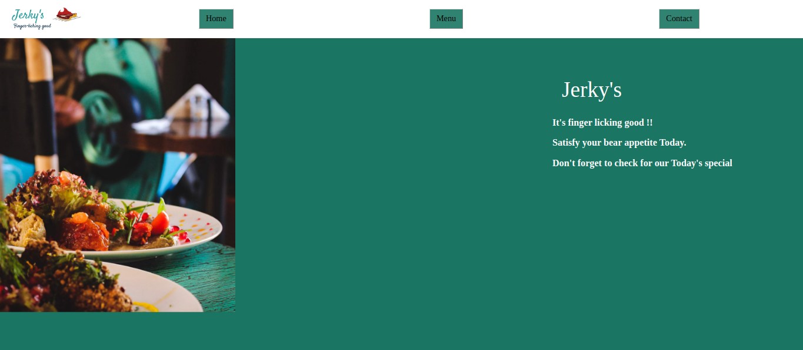

# RESTAURANT PAGE

The main purpose of this project is to make a restaurant page using Javascript. The content on the page was populated using JavaScript modules. This is part of the [Ordin projects](https://www.theodinproject.com/courses/javascript/lessons/restaurant-page) from the [microverse](https://www.microverse.org/)  JavaScript curriculum.

## FEATURES
- Homepage
- Menupage
- Contacts (The contacts are the developer's contacts)

## [DEMO LINK](https://rawcdn.githack.com/ampaire/restaurant-page-js/13ff0a359fb498f04db64321bbb35f96f6503fcf/dist/index.html)

## PREREQUISTES
To comfortably use this project, prior knowledge of the following is ideal
- HTML and CSS
- JavaScript
- Eslint
- Bootstrap 4
- Webpack
- npm

### SETUP
Run 
~~~ 
$git clone https://github.com/ampaire/restaurant-page-js.git 
~~~
to clone this project to your local machine and then we get started.

Next run
~~~
$npm install
~~~
to install all the modules that were used for this project.

You can then run the project in the live server if you have it installed in your code editor or by simply running the index.html page in the browser.

## AUTHOR
👤 **Phemia**

- Github: [@ampaire](https://github.com/ampaire)
- Twitter: [@AmpaPhem](https://twitter.com/AmpaPhem)
- Linkedin: [linkedin](https://linkedin.com/ampaire-phemia)

## 🤝 CONTRIBUTING

Contributions, issues and feature requests are welcome!

Feel free to check the [issues page](https://github.com/ampaire/restaurant-page-js/issues).

## SHOW SUPPORT

Give a ⭐️ if you like this project!

## ACKNOWLEDGEMENTS
- [Ordin](https://www.theodinproject.com/courses/javascript/lessons/restaurant-page)
- Hat tip to anyone whose code was used
